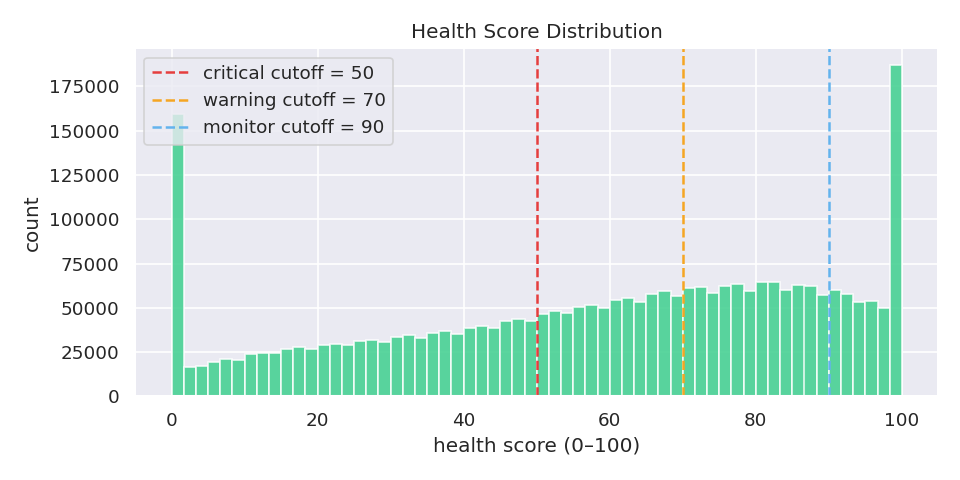
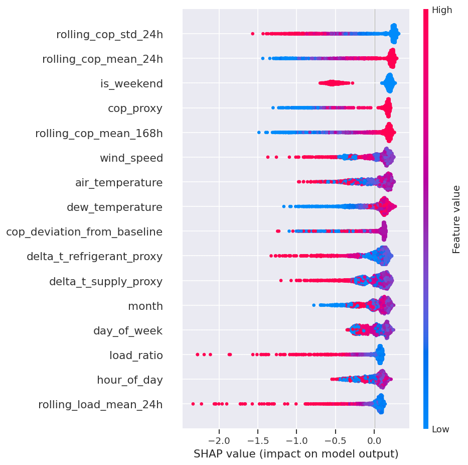

# HVAC Equipment Health Scoring

> **Predict equipment degradation before failure — domain-engineered features only an HVAC engineer would know to build.**

[](https://www.python.org/)
[](https://scikit-learn.org/)
[](https://fastapi.tiangolo.com/)
[](LICENSE)

HVAC systems fail in predictable ways — compressor fouling, refrigerant charge loss, heat exchanger degradation — but most operators react after failure. This project scores the health of HVAC units from operational sensor data (temperatures, pressures, flow rates, power draw), detects anomalies before failure, and surfaces SHAP-explained insights through a live dashboard.

**Built by an engineer who spent 3 years at Rheem Manufacturing designing these systems.**

**Live demo:** https://hvac-equipment-health.vercel.app  
**API docs:** https://hvac-health-api.onrender.com/docs

---

## What Makes This Different

Most DS candidates train a model on sensor data and call it predictive maintenance. This project starts from physics:

| Feature | Formula | Why it matters |
|---------|---------|---------------|
| **COP** | Cooling output / power input | The single best efficiency indicator in refrigeration — declining COP signals compressor wear before any alarm triggers |
| **ΔT supply** | T_supply_air − T_return_air | Measures heat exchange effectiveness; narrows as coil fouls |
| **ΔT refrigerant** | T_condenser − T_evaporator | Refrigerant circuit efficiency; widens as charge depletes |
| **Load ratio** | Actual load / rated capacity | High load ratio + declining COP = imminent failure zone |
| **Runtime fraction** | Hours running / hours in period | High runtime + poor COP = degradation accumulating |
| **Rolling COP deviation** | COP vs. 30-day rolling mean | Trend-based signal catches slow drift that threshold alarms miss |

These are not generic time-series features. They come from refrigeration thermodynamics and 3 years of product development at Rheem Manufacturing.

---

## Architecture

```
┌─────────────────────────────────────────────────────────────┐
│  DATA  (ASHRAE Great Energy Predictor III — 1,000+ buildings)│
│  Hourly sensor readings: temps, pressures, power, flow rates │
└───────────────────────┬─────────────────────────────────────┘
                        │
┌───────────────────────▼─────────────────────────────────────┐
│  FEATURE ENGINEERING  (src/features.py)                      │
│  COP · ΔT supply/refrigerant · Load ratio · Runtime frac.   │
│  Rolling 24-hr + 7-day stats · Time-of-day/season features  │
└───────────────────────┬─────────────────────────────────────┘
                        │
┌───────────────────────▼─────────────────────────────────────┐
│  ANOMALY DETECTION  (src/scorer.py)                          │
│  Isolation Forest (primary) · LOF (comparison)              │
│  Contamination = 0.05 (tuned against physical validation)   │
└───────────────────────┬─────────────────────────────────────┘
                        │
┌───────────────────────▼─────────────────────────────────────┐
│  HEALTH SCORE  0–100 gauge (src/scorer.py)                   │
│  Anomaly score → inverted, scaled, per-unit normalized       │
│  SHAP explains which sensor drove each unit's score          │
└───────────────────────┬─────────────────────────────────────┘
                        │
┌───────────────────────▼─────────────────────────────────────┐
│  DEPLOYMENT                                                  │
│  FastAPI (Render) ◄──► Vanilla JS dashboard (Vercel)        │
│  Unit selector · Health gauge · Sensor trends · Alert table │
└─────────────────────────────────────────────────────────────┘
```

---

## Tech Stack

| Layer | Tool | Notes |
|-------|------|-------|
| Feature engineering | Pandas, NumPy | COP, ΔT, load ratio, rolling stats |
| Anomaly detection | Isolation Forest (sklearn) | Primary model — no labels needed |
| Comparison | Local Outlier Factor (sklearn) | Density-based alternative |
| Interpretability | SHAP TreeExplainer | Per-unit sensor importance |
| API | FastAPI on Render | POST /score → health score + SHAP |
| Frontend | Vanilla HTML/CSS/JS (Vercel) | Health gauge, trend charts, alert table |
| Environment | conda (`environment.yml`) | |

---

## Key Results

| Metric | Value | Notes |
|--------|-------|-------|
| Readings scored | 2,876,400 | Hourly chilled-water readings (4.18M raw, filtered for rolling-history coverage) |
| Units analyzed | 497 | Buildings with ≥90 days of meter coverage |
| Anomaly rate (contamination=0.05) | 5.0% (143,820 readings) | Sensitivity-checked at 0.02 / 0.05 / 0.10 — all 0.02-flagged points remain flagged at 0.05 |
| Unit health scores | 35.0 – 74.0 (median 58.6) | Per-unit mean of the 0–100 reading-level score; 78 units land in the critical tier |
| Top SHAP feature | `rolling_cop_std_24h` | 24-hour COP volatility — intermittent-fault signature — edges out COP level itself |
| LOF vs IF agreement | 91.3% | On a 100k-reading comparison sample |





---

## Dataset

**ASHRAE Great Energy Predictor III**  
Source: [Kaggle competition](https://www.kaggle.com/c/ashrae-energy-prediction)  
- 1,000+ buildings, hourly meter readings + weather data (2016–2017)
- Covers chilled water, electricity, hot water, steam meters
- Download and place at `data/raw/` (see setup instructions below)

*Alternative:* UCI HVAC Fault Detection dataset (smaller, faster iteration — good for initial dev, swap to ASHRAE for final version).

---

## Setup

```bash
# 1. Clone
git clone https://github.com/aalias01/hvac-equipment-health
cd hvac-equipment-health

# 2. Create environment
conda env create -f environment.yml
conda activate hvac-health

# 3. Download data
# Kaggle CLI (requires kaggle.json in ~/.kaggle/):
kaggle competitions download -c ashrae-energy-prediction -p data/raw/
# Or download manually from https://www.kaggle.com/c/ashrae-energy-prediction

# 4. Run notebooks in order:
#    notebooks/01_eda.ipynb
#    notebooks/02_feature_engineering.ipynb
#    notebooks/03_anomaly_detection.ipynb

# 5. Start the API locally
uvicorn api.main:app --reload
# Visit http://localhost:8000/docs

# 6. Open the frontend
# Open frontend/index.html
# It points at the deployed API by default; for a local API run:
# localStorage.setItem("HVAC_API_BASE", "http://localhost:8000")
```

The API starts in degraded mode until model artifacts exist in `models/`. Run the notebooks through `03_anomaly_detection.ipynb` to create:

- `models/isolation_forest.joblib`
- `models/isolation_forest_scaler.joblib`
- `models/lof_model.joblib`
- `models/scorer_meta.json`
- `models/unit_baselines.joblib`

---

## Repository Structure

```
hvac-equipment-health/
├── README.md
├── .gitignore
├── environment.yml          ← conda (local dev)
├── requirements.txt         ← pip (Render deploy)
├── runtime.txt
├── render.yaml
│
├── data/
│   ├── raw/                 ← GITIGNORED — place ASHRAE CSVs here
│   └── processed/           ← GITIGNORED — generated by notebooks
│
├── notebooks/
│   ├── 01_eda.ipynb                  ← Sensor distributions, correlations, time-series
│   ├── 02_feature_engineering.ipynb  ← COP, ΔT, load ratio, rolling stats
│   └── 03_anomaly_detection.ipynb    ← Isolation Forest, LOF, health score, SHAP
│
├── src/
│   ├── features.py    ← Domain feature engineering (COP, ΔT, rolling stats)
│   └── scorer.py      ← Health score computation + anomaly flagging
│
├── api/
│   ├── main.py        ← FastAPI: POST /score, GET /health, GET /units
│   ├── schemas.py     ← Pydantic request/response models
│   └── predictor.py   ← Model loading + inference + SHAP
│
├── frontend/
│   ├── index.html     ← Dashboard: unit selector, health gauge, trends, alerts
│   ├── style.css      ← Dark theme (consistent with portfolio)
│   └── app.js         ← API calls, gauge render, chart render, alert table
│
├── models/            ← API runtime artifacts committed (see .gitignore)
│
└── figures/           ← Generated plots committed here
```

---

## Deployment

**Backend (Render):** Push repo → Render → Blueprint → connect repo (reads `render.yaml`).  
**Frontend (Vercel):** Connect repo → root directory `frontend/` → deploy.  
After both deploy: update `API_BASE` in `app.js` and CORS `allow_origins` in `api/main.py`.

---

## Interview Context

1. **The COP story:** *"Coefficient of Performance is the ratio of cooling output to power input — the single most important efficiency signal in refrigeration. It's the first number any HVAC engineer looks at when diagnosing a failing unit. Declining COP precedes compressor failure by weeks. Most DS candidates would never engineer that feature."*

2. **Unsupervised framing:** *"HVAC fault data is almost never labeled in practice — operators know something went wrong but rarely document it in a way a model can use. Isolation Forest doesn't need labels; it scores by how easily a point isolates from the rest. I set contamination=0.05 based on industry rule of thumb and validated it against physically unusual readings in EDA."*

3. **The health score translation:** *"I deliberately translated model output into engineering language — a 0–100 gauge rather than an anomaly probability. Operations staff don't think in probabilities; they think in traffic lights and thresholds. SHAP on top tells them which sensor is driving the score for that specific unit."*

4. **Domain moat:** *"This is the only project in my portfolio where 12 years of engineering experience is the competitive advantage, not just the context. No bootcamp graduate is going to engineer COP and ΔT features from scratch."*

---

*Built by [Alvin Alias](https://github.com/aalias01) — MS Data Science, University of Washington · 3 years HVAC product development at Rheem Manufacturing*
