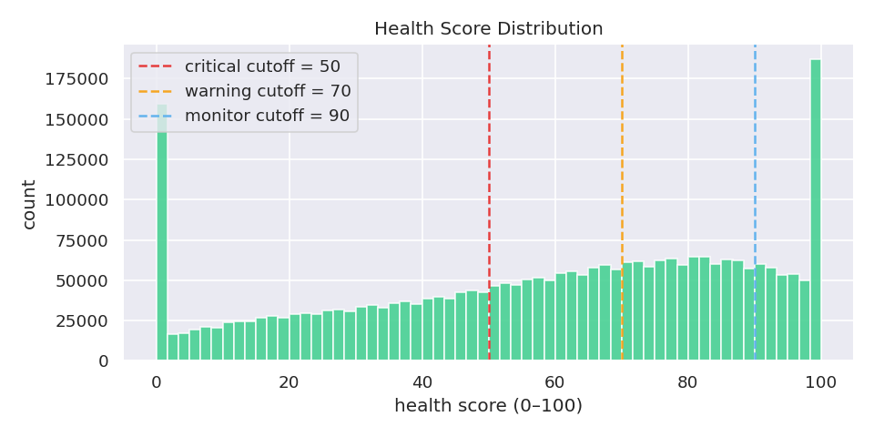
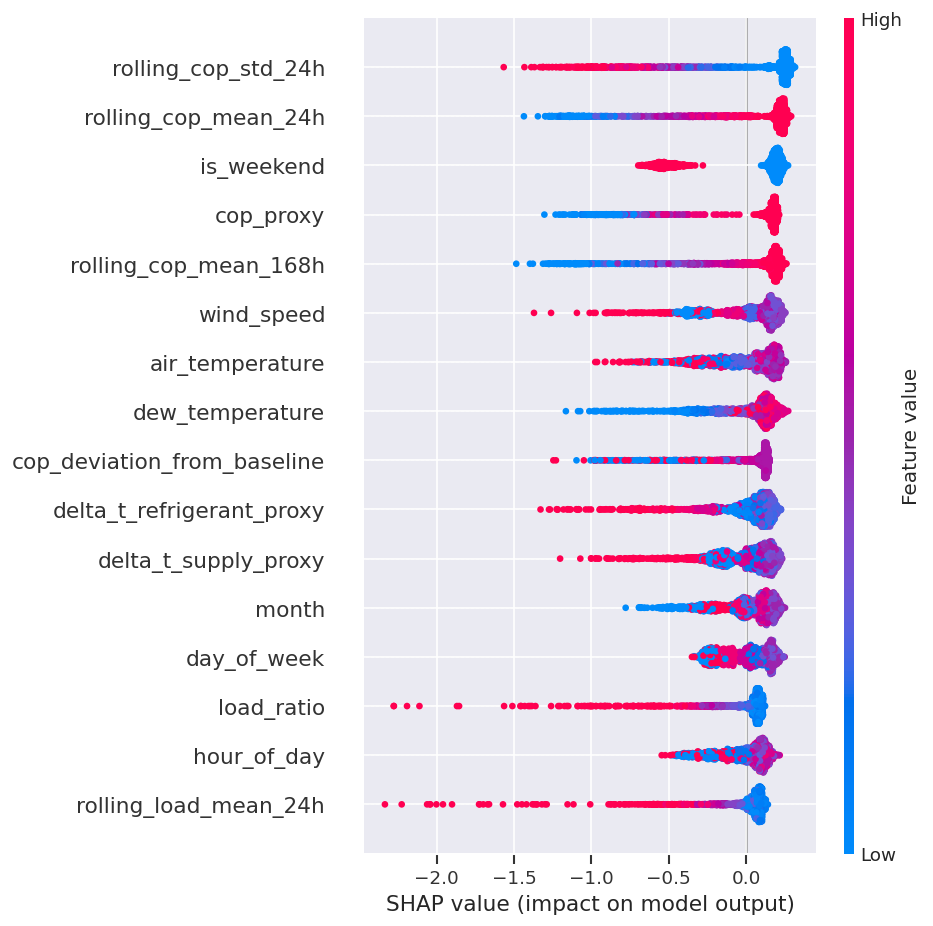

# HVAC Equipment Health Scoring

Scores the health of HVAC units (0 to 100) from operational sensor data and explains each score with SHAP. Features are physics-derived: COP, temperature deltas, load ratio. I spent 3 years in product development at Rheem Manufacturing working on these systems, and the feature set comes from that domain knowledge rather than generic time-series statistics.

[](https://www.python.org/)
[](https://scikit-learn.org/)
[](https://fastapi.tiangolo.com/)
[](https://github.com/aalias01/hvac-equipment-health/actions/workflows/ci.yml)
[](LICENSE)

**[Live demo](https://hvac.alvinalias.com)** | **[API docs](https://hvac-health-api.onrender.com/docs)**

## Why

HVAC systems fail in predictable ways: compressor fouling, refrigerant charge loss, heat exchanger degradation. Most operators still react after failure. This project detects the degradation early from hourly meter data, without needing labeled failures.

## The features

| Feature | Formula | What it signals |
|---------|---------|-----------------|
| COP | Cooling output / power input | The best single efficiency indicator in refrigeration; declining COP signals compressor wear before any alarm triggers |
| Delta-T supply | T_supply_air - T_return_air | Heat exchange effectiveness; narrows as the coil fouls |
| Delta-T refrigerant | T_condenser - T_evaporator | Refrigerant circuit efficiency; widens as charge depletes |
| Load ratio | Actual load / rated capacity | High load ratio plus declining COP is the imminent-failure zone |
| Runtime fraction | Hours running / hours in period | High runtime plus poor COP means degradation is accumulating |
| Rolling COP deviation | COP vs 30-day rolling mean | Catches slow drift that threshold alarms miss |

## Results

| Metric | Value | Notes |
|--------|-------|-------|
| Readings scored | 2,876,400 | Hourly chilled-water readings (4.18M raw, filtered for rolling-history coverage) |
| Units analyzed | 497 | Buildings with at least 90 days of meter coverage |
| Anomaly rate (contamination=0.05) | 5.0% (143,820 readings) | Sensitivity-checked at 0.02 / 0.05 / 0.10; every point flagged at 0.02 stays flagged at 0.05 |
| Unit health scores | 35.0 to 74.0, median 58.6 | Per-unit mean of the reading-level score; the live fleet strip presents rank-relative bands |
| Top SHAP feature | `rolling_cop_std_24h` | 24-hour COP volatility (an intermittent-fault signature) outranks COP level itself |
| LOF vs Isolation Forest agreement | 91.3% | On a 100k-reading comparison sample |





See the [model card](models/MODEL_CARD.md) for score meaning, detector limits, and data provenance.

## How it works

```
ASHRAE meter data (hourly: temps, power, flow)
        |
feature engineering (src/features.py)
  COP, delta-T, load ratio, runtime fraction, rolling 24h/7d stats
        |
anomaly detection (src/scorer.py)
  Isolation Forest (primary), LOF (comparison), contamination 0.05
        |
health score 0-100, per-unit normalized
  SHAP explains which sensor drove each unit's score
        |
FastAPI (Render)  <->  vanilla JS operations wall (Vercel)
  scored fleet snapshot, curated demo readings, detector cross-check
```

## Tech stack

Python 3.11, Pandas, NumPy, scikit-learn 1.7 (Isolation Forest, LOF), SHAP TreeExplainer, FastAPI on Render, vanilla HTML/CSS/JS operations wall on Vercel. Environments: `environment.yml` (conda, local) and `requirements.txt` (pip, Render).

## Dataset

**ASHRAE Great Energy Predictor III** ([Kaggle competition](https://www.kaggle.com/c/ashrae-energy-prediction)): 1,000+ buildings, hourly meter readings plus weather, 2016 to 2017, covering chilled water, electricity, hot water, and steam meters. Used under the competition's data rules.

## Run it locally

```bash
git clone https://github.com/aalias01/hvac-equipment-health
cd hvac-equipment-health
conda env create -f environment.yml
conda activate hvac-health

# data (requires kaggle.json in ~/.kaggle/)
kaggle competitions download -c ashrae-energy-prediction -p data/raw/
```

Run the notebooks in order: `01_eda.ipynb`, `02_feature_engineering.ipynb`, `03_anomaly_detection.ipynb`. Notebook 03 writes the model artifacts the API needs:

```
models/isolation_forest.joblib
models/isolation_forest_scaler.joblib
models/lof_model.joblib
models/scorer_meta.json
models/unit_baselines.joblib
```

Build the curated demo readings from real feature rows:

```bash
python scripts/curate_demo_readings.py
```

That writes `models/demo_readings.json`, a small API runtime artifact used by `/demo-readings`.

Then start the API and open the frontend:

```bash
uvicorn api.main:app --reload
# docs at http://localhost:8000/docs
```

Open `frontend/index.html`. It points at the deployed API by default; for a local API, run `localStorage.setItem("HVAC_API_BASE", "http://localhost:8000")` in the browser console. The fleet board is a scored snapshot from `models/unit_baselines.joblib`, not live telemetry. The score button draws from complete historical readings in `models/demo_readings.json` instead of placeholder sensor defaults. The API starts in degraded mode until the model artifacts exist.

Run tests and lint:

```bash
python -m pip install -r requirements-dev.txt
ruff check .
pytest -q
```

## Limitations

- ASHRAE meters are building-level, so "unit" here means a building's chilled-water system, not an individual compressor. The physics features still apply, but a real deployment would use equipment-level telemetry.
- Anomaly detection is unsupervised; there are no ground-truth failure labels in this dataset to compute precision or recall against.
- The API runs on Render's free tier; the first request after idle can take around a minute to cold-start.

## Deployment

Backend: push to GitHub, then Render > Blueprint > connect the repo (`render.yaml` does the rest). Frontend: connect the repo on Vercel with root directory `frontend/`. After both deploy, update `API_BASE` in `app.js` and `allow_origins` in `api/main.py`.

## Project structure

```
├── notebooks/       # 01 EDA, 02 features, 03 anomaly detection + scoring
├── src/             # features.py, scorer.py
├── api/             # FastAPI: main.py, schemas.py, predictor.py
├── frontend/        # operations wall (Vercel)
├── scripts/         # reproducible curation utilities
├── models/          # API runtime artifacts (committed)
├── figures/         # generated plots
└── data/            # gitignored; download from Kaggle
```

Built by [Alvin Alias](https://github.com/aalias01), MS Data Science, University of Washington. 3 years HVAC product development at Rheem Manufacturing.
